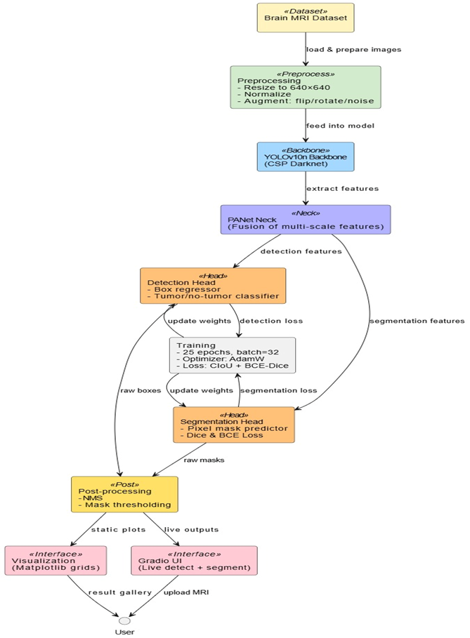
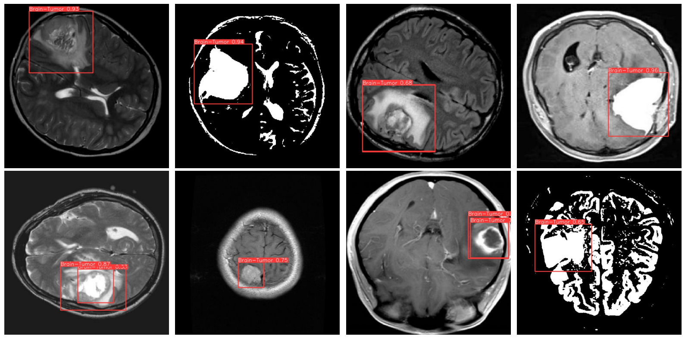

## **YOLO-Based Deep Learning for Automated Brain Tumor Detection and Classification in MRI**

**Team:**  
**K CHARAN (22BCE1759)**  
**K VISWADHAR (22BCE1950)**  

---

## **About Brain Tumors and Detection**

### **What is a Brain Tumor?**
A brain tumor is an abnormal growth of cells within the brain or central spinal canal. Tumors can be:
- **Benign (non-cancerous)**  
- **Malignant (cancerous)**  

They may originate in the brain (primary tumors) or spread from other body parts (secondary/metastatic). Depending on size, type, and location, brain tumors can interfere with brain functions, causing symptoms like:
- Headaches  
- Seizures  
- Cognitive decline  
- Neurological deficits  

---

### **Importance of Early Detection**
Early and accurate detection is critical for:
- Timely treatment planning (surgery, chemotherapy, radiotherapy)  
- Reducing mortality rates  
- Improving quality of life and survival  

MRI (Magnetic Resonance Imaging) is commonly used for visualization. However, manual interpretation is:
- Time-consuming  
- Subjective  
- Prone to human error  
---

## **YOLO and Its Role in Tumor Detection**

### **What is YOLO?**
**YOLO (You Only Look Once)** is a state-of-the-art real-time object detection algorithm that:
- Treats detection as a **single regression problem**
- Predicts **bounding boxes** and **class probabilities** directly from images in **one evaluation**

---

### **Why YOLO for Medical Imaging?**
YOLO is ideal for brain tumor detection because of:
- **Speed** – Enables real-time diagnosis  
- **Accuracy** – High precision and recall, even for complex tumor shapes  
- **End-to-end training** – Simplifies optimization  
- **Simultaneous localization and classification** – Detects presence and position of tumors

---

### **YOLOv10: The Latest and Fastest**
**YOLOv10 (2024)** brings key improvements:
- Higher performance with **fewer parameters**  
- Better at detecting **small objects** (e.g., early-stage tumors)  
- Works efficiently on **low-resource environments**

This project uses **YOLOv10n (nano version)** – optimized for:
- **Speed and resource-efficiency**  
- **Deployment in real-time and embedded systems**  

---

## **Architecture Diagram**

---

## **Results or Output**

---

## **References**

To access references:  
🔗 [Click Here](https://drive.google.com/drive/folders/1D-YzYBjRMhMxMKBBkwV_EVmvGPjIrfrE?usp=drive_link)

---
